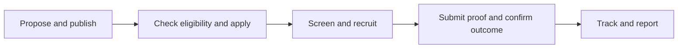
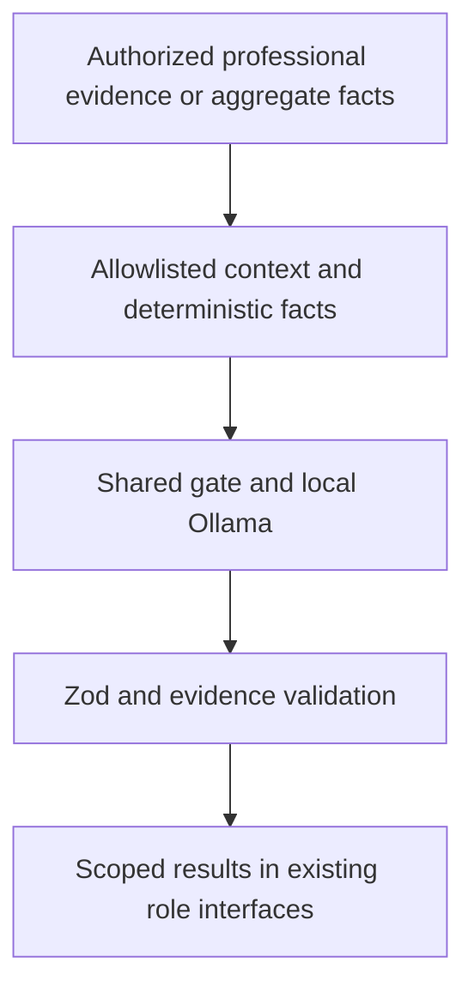
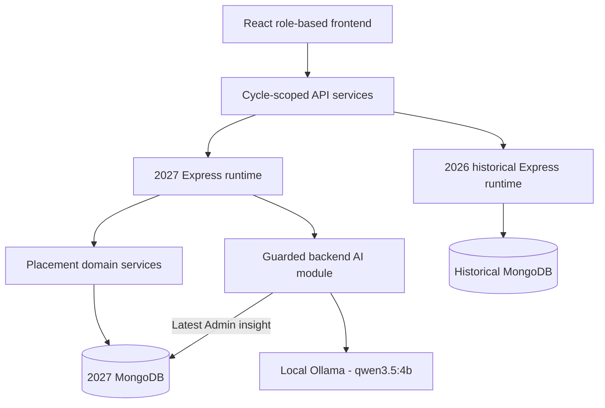

<div align="center">

# PlacementHub

### From professional profiles to verified placement outcomes.

A full-stack placement platform for one college, three roles, and the complete recruitment journey.

<p>
  
  
  
  
  
</p>

[Explore the product](#key-capabilities) · [AI intelligence](#ai-intelligence) · [Run locally](#local-setup) · [Documentation](#documentation)

**2027 Current** &nbsp; / &nbsp; **2026 Historical** &nbsp; / &nbsp; **Public deployment pending**

</div>

---

## Overview

PlacementHub-V2 brings Student preparation, Company recruitment, and Placement Admin oversight into one MERN application. Verified profiles, approved drives, rule-based eligibility, applications, recruitment phases, confirmed outcomes, and reports share one connected workflow—with contextual local AI alongside it.

Built as a final-year college project, the platform is complete through **M10**, including Student, Company, and Admin intelligence plus runtime recovery. **M11 has not started.** Final QA, visual polish, production readiness, and public deployment remain ahead.

## Why PlacementHub

Placement work spans resumes, approvals, applicant lists, phase updates, and reports. PlacementHub connects those records so each role works from the same recruitment state, with clear ownership and authorized access.

| Need | PlacementHub approach |
| :--- | :--- |
| Prepare Students for recruitment | Professional profiles, resumes, verification, and preparation guidance |
| Keep applications consistent | Backend eligibility rules with readable reasons; AI never overrides Apply |
| Track recruitment progress | Company phases, scoped resources, progress history, and verified outcomes |
| Understand placement performance | Trusted analytics, Excel reports, and grounded Admin insights |
| Preserve historical records | Separate backend runtimes and databases for each placement cycle |

## Key capabilities

| Area | Implemented experience |
| :--- | :--- |
| **Identity & access** | Student, Company, Placement Admin; authentication, role and ownership checks |
| **Profiles & resumes** | Skills, projects, experience, credentials, professional links, PDF resumes, verification |
| **Placement drives** | Proposals, approval, publication, structured requirements, documents, lifecycle controls |
| **Applications & recruitment** | Eligibility, Phase 0 screening, Company phases, provisional selection, confirmed outcomes |
| **Resources & communication** | Schedules, instructions, authorized attachments, targeted notifications |
| **Community** | Feed, Articles, social profiles, showcases, likes, comments, moderation |
| **Analytics & exports** | Role dashboards, branch/company performance, drive monitoring, funnels, Excel reports |
| **Local intelligence** | Career preparation, role fit, candidate review, placement insights, contextual Ask AI |

## Role experiences

| Student | Company | Placement Admin |
| :--- | :--- | :--- |
| Build a profile and upload a resume | Maintain an approved Company profile | Verify Students and approve Companies |
| Browse drives and inspect eligibility | Propose drives and recruitment phases | Review proposals and publish drives |
| Apply and follow recruitment progress | Explore applicants and manage phases | Monitor drives, outcomes, and performance |
| Access phase resources and notifications | Share resources and notify applicants | Confirm placement records and export reports |
| Use Career AI and Drive AI | Use objective matching, candidate AI, small batches, group questions | Generate insights, ask analytics questions, recover AI runtime |

A verified Student can replace a resume **without losing verification or requiring re-verification**. Resume-dependent AI context updates independently of unrelated professional inputs.

## Placement workflow



Companies define **1–5 recruitment phases**; Phase 0 is system-owned. Postponement, cancellation, and completion preserve records and history. Authorized people and backend rules control recruitment transitions and confirmed outcomes.

## Community & notifications

The current cycle includes **Feed, Articles, Profiles, and Notifications** with ownership/moderation rules and professional showcases. Recruitment notifications carry drive and phase context; Community notifications remain a separate domain.

**Social activity never contributes to professional AI scoring or candidate ranking.**

## Analytics & reporting

Students see their placement journey, Companies see their drives and applicants, and Placement Admins see institutional performance.

| Trusted analytics | Operational reporting |
| :--- | :--- |
| Eligible, placed, and unplaced Students | Drive history and monitoring |
| Branch rates and Company performance | Applications, phases, exits, confirmed outcomes |
| Package statistics and activity trends | Filters, scoped candidate pools, Excel exports |

Admin AI explains backend facts. It cannot query MongoDB or change placement records. Offer-record counts and unique placed-Student counts retain their distinct reporting meanings.

## AI intelligence

**Ollama + `qwen3.5:4b`**, running locally in non-thinking mode, powers the current implementation. Inference stays behind the backend; the frontend never calls the model directly. A generic provider boundary supports future integration, with **no automatic external fallback**.

| Feature | Instant trusted layer | Explicit AI layer |
| :--- | :--- | :--- |
| **Student Career** | Objective Profile Score with earned/max dimensions | Independent AI Assessment and profile/resume preparation advice |
| **Student Drive** | Objective Match from documented requirements | Independent AI Role Fit and preparation questions |
| **Company Candidate** | Fast objective matching across authorized applicants | Individual fit, serial batches, interviewer focus, bounded group comparisons |
| **Admin Placement** | Aggregate analytics and exact fact answers | Placement insights and operational recommendations; no Admin AI score |

### Grounded advice, separate decisions



- **Independent scores:** objective and AI assessments are separate. No weighted combined score; eligibility and Apply remain authoritative.
- **Actual resume evidence:** backend PDF extraction provides bounded professional text when available. Unreadable/scanned PDFs fall back gracefully; no OCR or unsupported ATS/layout claims.
- **Professional context only:** gender, photos, MBTI/personality, hobbies, Community activity, and private contact details are excluded. Missing evidence means **not documented**, not proof of inability.
- **Useful general knowledge:** technical learning and preparation suggestions are allowed. Person- and Company-specific claims must be grounded in supplied evidence.
- **Manual analysis:** Generate/Refresh retains prior success, shows timestamps, and marks relevant changes stale. Reloads do not start inference.
- **Latest answer only:** Ask AI replaces the previous question/answer. No chat-history database or accumulating conversation.

### Runtime safety & result retention

| Safeguard | Current behavior |
| :--- | :--- |
| **One shared generation** | `AI_MAX_CONCURRENT=1` across Student, Company, and Admin |
| **Busy handling** | Other individual requests require retry; identical work may coalesce or use cache |
| **Company batches** | Explicit, sequential; default 4 candidates, local hard cap 5; no automatic cohort scan |
| **Group context** | Retrieve a small relevant set and send compact evidence, not every full resume |
| **Timeout & recovery** | 180-second deadline, independent 1-second recovery grace, abort signals, epoch protection |
| **Admin recovery** | Confirmed reset cancels active/pending work without deleting successful results |
| **Durable Admin insights** | Latest insight survives reload, login, and backend restart in the 2027 database |
| **Student/Company assessments** | Scoped memory results survive reload and recovery; expire after 24 hours or backend restart |

Local CPU inference is conservative. Observed calls range from **8–21 seconds for short synthetic replies** to **about 1–2.5 minutes for richer live analyses**. Speed and wording quality depend on context and hardware. Invalid output is safely rejected; normal placement workflows remain usable without AI.

[AI architecture and limitations →](docs/ai.md)

## Placement cycles

One codebase and frontend, **separate backend runtimes and databases**.

| | 2027 · Current/default | 2026 · Archived/local |
| :--- | :--- | :--- |
| API | `http://localhost:5001/api/v1` | `http://localhost:5000/api/v1` |
| Database | `placementhub-v2-demo-2027` | `placementhub-v2` |
| M10 AI | Enabled when configured | No AI UI, routes, provider, or cache initialization |
| Purpose | Current workflows, Community, intelligence | Preserved historical records |

The AI guard checks the **exact database name**, not just a year label. Cycle selection also scopes frontend authentication sessions. Historical integrity is checked against the accepted baseline.

## Tech stack

<p>
  
  
  
  
  
  
  
</p>

| Layer | Tools |
| :--- | :--- |
| Web application | React Router, Vite, Tailwind CSS |
| API & storage | Node.js, Express, MongoDB, Mongoose |
| Contracts & access | Zod, JWT, bcryptjs, express-rate-limit |
| Documents & exports | Multer, PDF.js, ExcelJS |
| Local intelligence | Ollama, native fetch, structured JSON, evidence validation |
| Verification | Node test runner, React/JSDOM, Oxlint, syntax checks, Vite build |

## High-level architecture



The backend is a **modular monolith** with domain routes, controllers, services, validation, and models. Frontend pages compose features and use API services. AI supplements these modules rather than replacing business rules.

## Milestones

| Checkpoint | Delivered |
| :--- | :--- |
| **M0–M2 · Complete** | Blueprint, MERN foundation, authentication, role authorization |
| **M3–M4 · Complete** | Student profiles/resumes/verification, Company approval, institution settings |
| **M5–M7 · Complete** | Drive proposals, eligibility, applications, recruitment, verified outcomes |
| **M8 · Complete** | Dashboards, monitoring, analytics, reporting, Excel exports |
| **M9 · Complete** | Community, social profiles, showcases, separate notifications |
| **M10 · Complete** | Student, Company, Admin intelligence; AI runtime recovery |
| **M11 · Not started** | Final QA, UI/responsive polish, production readiness, deployment, presentation |

[Detailed roadmap →](docs/roadmap.md)

## Testing & reliability

Latest verified application checkpoint: **`bd2f0bd` — Admin AI runtime recovery**. These are recorded checkpoint results, not live CI badges.

| Check | Verified result |
| :--- | ---: |
| Current-cycle backend regression | **428 / 428** |
| AI suite · subset of backend tests | **96 / 96** |
| Frontend tests | **100 / 100** |
| AI syntax targets | **50 / 50** |
| Archived collection count/hash checks | **20 / 20 unchanged** |

Automated AI tests use mocked providers. Live checks covered cancellation, fresh requests after recovery, retained Admin insights, and reload without inference. Authorization, privacy, stale fingerprints, timeouts, and late-output protection have focused coverage.

Syntax, frontend lint/build, and whitespace checks passed. Six existing frontend lint warnings and a bundle-size advisory remain; these counts do not imply completed production QA.

[Testing notes →](docs/testing.md) · [Security boundaries →](docs/security.md)

## Local setup

### 1. Prerequisites & dependencies

Use **Node.js 24** (the verified local runtime), npm, and a running local MongoDB instance. Ollama is optional for normal workflows and required for AI replies.

```sh
git clone --branch demo-2027-m9 https://github.com/Suryansh23-IT/PlacementHub-V2.git
cd PlacementHub-V2
npm install --prefix backend
npm install --prefix frontend
```

### 2. Configure a fresh clone

PowerShell, from the repository root. Retain existing configured files when continuing an existing checkout:

```powershell
Copy-Item backend/.env.example backend/.env
Copy-Item backend/.env.cycle-2027.example backend/.env.cycle-2027
Copy-Item frontend/.env.example frontend/.env
```

In `backend/.env`, replace `JWT_SECRET` and `ADMIN_BOOTSTRAP_SECRET` with separate secure random values of at least 32 characters. First Placement Admin registration uses the bootstrap secret. Keep secrets out of version control.

The supplied current-cycle example sets port **5001** and database **`placementhub-v2-demo-2027`**. The launcher loads it before backend defaults. Frontend defaults map 2027 to port 5001 and 2026 to port 5000.

For AI, set these values **only in `backend/.env.cycle-2027`**:

```dotenv
AI_ENABLED=true
AI_PROVIDER=ollama
OLLAMA_BASE_URL=http://127.0.0.1:11434
OLLAMA_MODEL=qwen3.5:4b
AI_MAX_CONCURRENT=1
AI_TIMEOUT_MS=180000
```

Leave `AI_ENABLED=false` to run without inference. No paid API key is required.

### 3. Start local services

For a fresh Ollama installation, download the model once:

```sh
ollama pull qwen3.5:4b
```

If Ollama is not already serving, start it in its own PowerShell terminal:

```powershell
$env:OLLAMA_NUM_PARALLEL="1"
ollama serve
```

From the repository root, use separate terminals:

```sh
# Current-cycle backend
npm run dev:cycle:2027 --prefix backend
```

```sh
# Frontend
npm run dev:frontend
```

Open **http://localhost:5173**. Register through the normal authentication flow; first Admin registration requires the bootstrap secret. Company approval and Student verification remain normal Admin workflows. Setup does not seed or reset any database.

<details>
<summary><strong>Optional: existing archived runtime</strong></summary>

The historical cycle requires an existing dataset and configured `backend/.env.cycle-2026`, with port 5000 and database `placementhub-v2`. Start it separately:

```sh
npm run dev:cycle:2026 --prefix backend
```

It is independent of 2027 and needs no AI configuration. Historical reconstruction/integrity procedures are documented in [Testing](docs/testing.md); they are not part of ordinary startup.

</details>

### 4. Run checks

From the repository root:

```sh
npm test --prefix frontend
npm run test:ai --prefix backend
npm run check:ai --prefix backend
npm run check:backend
npm run lint
npm run build
git diff --check
```

The broader backend command is `npm run test:backend`. Its live historical reconciliation test requires the archived environment/dataset. Use the separation of current regression and historical checks described in [Testing](docs/testing.md), rather than treating the current database as the historical oracle. Automated AI tests do not call the live model.

## Repository layout

```text
PlacementHub-V2/
├── frontend/
│   ├── src/          Pages, features, components, API services, cycle context
│   └── test/         Frontend behavior and contract tests
├── backend/
│   ├── src/modules/  Domain modules, analytics, Community, AI
│   ├── scripts/      Cycle startup, checks, controlled data utilities
│   └── test/         Backend, AI, access, and workflow tests
└── docs/             Architecture, APIs, workflows, security, checkpoints
```

## Documentation

[Requirements](docs/requirements.md) · [Architecture](docs/architecture.md) · [Database](docs/database.md) · [API](docs/api.md) · [Workflows](docs/workflows.md) · [AI](docs/ai.md) · [Security](docs/security.md) · [Testing](docs/testing.md) · [UI](docs/ui.md) · [Decisions](docs/decisions.md) · [Roadmap](docs/roadmap.md)

## Current status & next chapter

**M0–M10 complete. M11 pending.** Verified locally; public deployment is not complete. M11 covers final QA, visual/responsive polish, production readiness, deployment, and presentation.

| Live Demo | Screenshots | Deployment |
| :--- | :--- | :--- |
| Coming in M11 | Curated product gallery coming in M11 | Public hosting and inference configuration coming in M11 |

---

<div align="center">

**PlacementHub-V2** · Built for a college placement cell.

Clear workflows. Trusted placement records. Contextual intelligence.

[Back to top](#placementhub)

</div>
